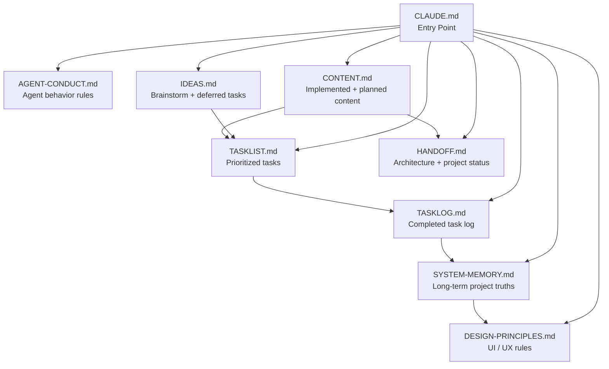

```mermaid
graph TD
  A[CLAUDE.md<br>Entry Point] --> B[TASKLIST.md<br>Prioritized tasks]
  A --> C[TASKLOG.md<br>Completed task log]
  A --> D[HANDOFF.md<br>Architecture + project status]
  A --> E[DESIGN-PRINCIPLES.md<br>UI / UX rules]
  A --> F[SYSTEM-MEMORY.md<br>Long-term project truths]
  A --> G[AGENT-CONDUCT.md<br>Agent behavior rules]
  A --> H[IDEAS.md<br>Brainstorm + deferred tasks]
  A --> I[CONTENT.md<br>Implemented + planned content]

  B --> C
  C --> F
  H --> B
  I --> B
  I --> D
  F --> E
```